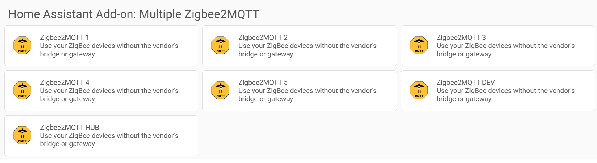
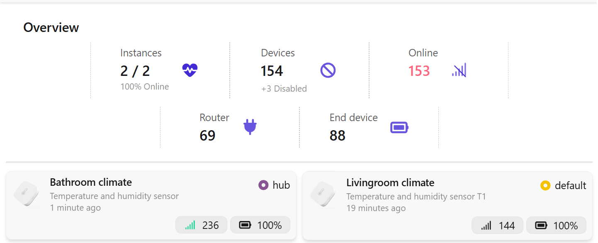

# 🔀 Multiple Zigbee2MQTT

Home Assistant *does* allow you to run multiple Zigbee2MQTT add-ons — but setting this up can be a bit hacky 🤕
On top of that, all instances end up with the same name, which gets confusing *fast*.

This add-on exists for one simple reason: **to make that experience smoother** ✨

> [!TIP]
> Got questions or feedback? \
> Find me on the Home Assistant Community: [studioIngrid](https://community.home-assistant.io/u/studioingrid) \
> Or reply in the discussion [thread](https://community.home-assistant.io/t/add-connection-state-online-offline-to-every-z2m-device-or-other-mqtt-device)

This repository acts as a **small configuration wrapper** around
`hassio-zigbee2mqtt/zigbee2mqtt`.

It **only changes the add-on name**. 🚫 No behavior is modified. ✅ Zigbee2MQTT works exactly the same.

🔗 For the Zigbee2MQTT project itself, visit the developer’s GitHub:
[https://github.com/Koenkk/zigbee2mqtt](https://github.com/Koenkk/zigbee2mqtt)

🔗 For the original Home Assistant add-on configuration, see:
[https://github.com/zigbee2mqtt/hassio-zigbee2mqtt](https://github.com/zigbee2mqtt/hassio-zigbee2mqtt)

## ✨ Features

* 🔄 Follows official Zigbee2MQTT releases
* 🏷️ Supports multiple clearly named instances

  * Zigbee2MQTT 1
  * Zigbee2MQTT 2
  * Zigbee2MQTT 3
  * Zigbee2MQTT 4
  * Zigbee2MQTT 5
  * Zigbee2MQTT Hub
  * Zigbee2MQTT Dev

## Installation

* Go to *Settings* → *Add-ons*
* Click *Add-on Store* (bottom right)
* Click the *three-dot menu* (top right) → *Repositories*
* Add the following URL:

```
https://github.com/studioIngrid/hassio-multiple-zigbee2mqtt
```

* Click *Add*
* Close the popup
Scroll down — you should now see the new add-on options


## 🖥️ One frontend for all instances

With the introduction of the new Zigbee2MQTT frontend **WindFront**, a standalone frontend add-on is available from its designer [**Nerivec**](https://github.com/Nerivec).

This allows you to manage **all Zigbee2MQTT instances from a single UI** 🎉

### 🔓 Open frontend ports

To use WindFront, each Zigbee2MQTT instance needs a frontend port.

* Open the *configuration page* of your Zigbee2MQTT instance
* Scroll to *Network*
* Enable *Show disabled ports*


* Configure a **Frontend TCP listen port**, for example: /
 `8091`, `8092`, `8093`

Repeat this for **each instance**.

### 📦 Install WindFront

* Go to *Settings → Add-ons*

* Click *Add-on Store*

* Open the *three-dot menu* → *Repositories*

* Add this URL:

```
https://github.com/Nerivec/ha-zigbee2mqtt-windfront
```

* Click *Add*
* Close the popup

Scroll down and install the **Zigbee2MQTT WindFront** add-on.

### ⚙️ Configure WindFront

* Open the *WindFront add-on configuration*
* Set:
  * **API URLs**: `<YOUR-HA-IP>:8091/api,<YOUR-HA-IP>:8092/api`
  * **API Names** `default,hub`
* Start the add-on ▶️



You’ll now see the **origin** of each device in the top-right corner.

Next to **Permit join** the dropdown is changed, you can choose: Default (all), Hub (all), or any individual routers.
